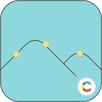

#  Contentful hotspot configurator

The hotspot configurator is a custom app built with the Contentful App Framework.\
It let's you define hotspots over an image with a drag functionality.
<br/>
<br/>

<br/>
<br/>

## Demo

[https://hotspot-configurator-demo.vercel.app/](https://hotspot-configurator-demo.vercel.app/)

<br/>
<br/>
<br/>

## What's inside?

The repo has been created from the basic [Turborepo](https://turbo.build/repo/docs/getting-started/create-new) example and uses [pnpm](https://pnpm.io) as a package manager. It includes the following packages/apps:

### Apps and Packages:

- `contentful-app`: the contentful app created with `create-contentful-app` builder tool. Available at http://localhost:3000
- `demo`: the demo app built with [Next.js](https://nextjs.org). Available at http://localhost:5000
- `shared`: a package shared by both `contentful-app` and `demo` applications.
- `tailwind-config`: tailwind configuration used by `shared`, `contentful-app` and `demo`
- `eslint-config-custom`: `eslint` configurations (includes `eslint-config-next` and `eslint-config-prettier`)
- `tsconfig`: `tsconfig.json`s used throughout the monorepo

### Build

To build all apps and packages, run the following command:

```
cd hotspot-configurator
pnpm run build
```

### Develop

To develop all apps and packages, run the following command:

```
cd hotspot-configurator
pnpm run dev
```

## Useful Links

Learn more about the power of Turborepo:

- [Contentful](https://www.contentful.com)
- [Contentful App Framework](https://www.contentful.com/developers/docs/extensibility/app-framework/)
- [Next.js](https://nextjs.org)
- [Tailwindcss](https://tailwindcss.com/)
- [Turborepo](https://turborepo.org)